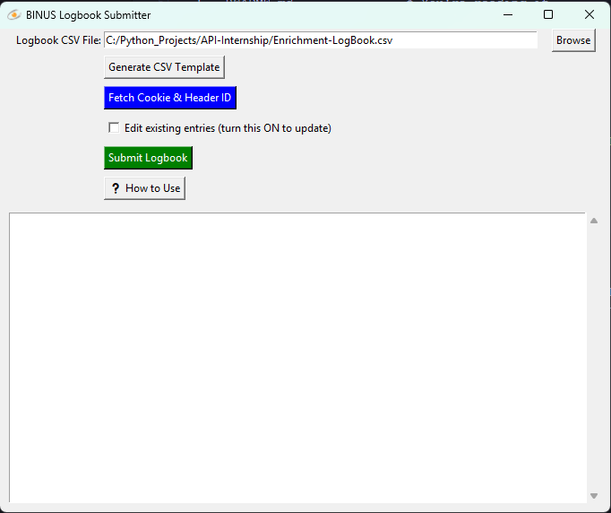

````markdown
# 📓 BINUS Logbook Submitter

A simple Python GUI tool to automatically submit your BINUS Enrichment logbook entries using a CSV file.

## ⚙️ Features

- 📝 Generate a CSV template for logbook entries
- 📂 Load and edit your logbook entries from CSV
- ✏️ Edit mode to update existing logbook entries
- 🚀 Submit logbook entries directly and automatically to the BINUS system
- ✅ Standalone .exe

## 📦 Requirements for development

- Python 3.8+
- Dependencies (install via pip):
- Playwright


## 🖥️ How to Use

1. **Generate CSV Template**
   Click "Generate CSV Template" to create a blank logbook format.

2. **Fill in the CSV**
   Edit the generated CSV with your activities. Required columns:

   * `date` (YYYY-MM-DD)
   * `activity`
   * `clockin` (HH\:MM)
   * `clockout` (HH\:MM)

3. **Fetch Cookie & Header ID**
   Click to open the browser, log in to BINUS Enrichment, and let the tool capture the session cookies automatically.

4. **(Optional) Edit Mode**
   Enable "Edit existing entries" if you want to update entries that are already submitted.

5. **Submit Logbook**
   Click "Submit Logbook" to send your entries. You'll need at least **10 valid activity days** to submit.

## 📁 File Structure

```
project/
│
├── logo.ico                # App icon (optional)
├── main.py                 # Main Python script
├── requirements.txt        # Python dependencies
└── README.md               # You're reading it
```

## 🛠️ Packaging to EXE (optional)

To build a standalone Windows executable:

```bash
pyinstaller --onefile --noconsole --icon=logo.ico main.py
```

## 📸 GUI Preview



## 🧠 Notes

* This tool simulates your browser login using Playwright — your credentials are not stored unless you choose to save them.
* Works best when you are already enrolled in Enrichment and have at least one entry submitted manually.

---

Feel free to contribute or fork the project! 🚀
